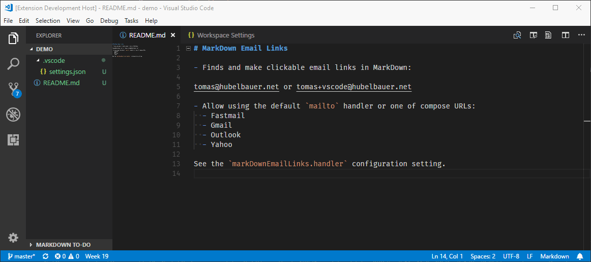

# vscode-markdown-email-links README

Highlights email addresses in MarkDown documents and makes them clickable `mailto` links handled by the system associated program for `mailto`.

## Release Notes

See the [change log](CHANGELOG.md).
