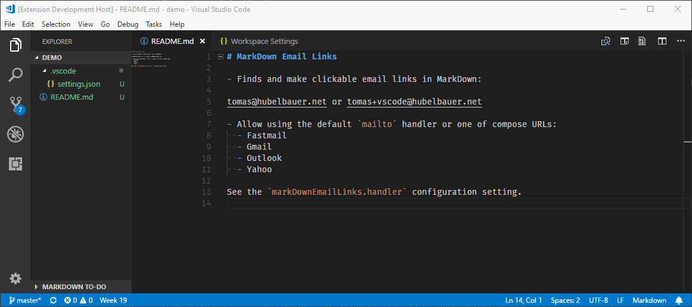

# MarkDown Email Links

Highlights email addresses in MarkDown documents and makes them clickable `mailto` links handled by the system associated program for `mailto`.

## Release Notes

See the [change log](CHANGELOG.md).

[In the Marketplace](https://marketplace.visualstudio.com/items?itemName=TomasHubelbauer.vscode-markdown-email-links)
